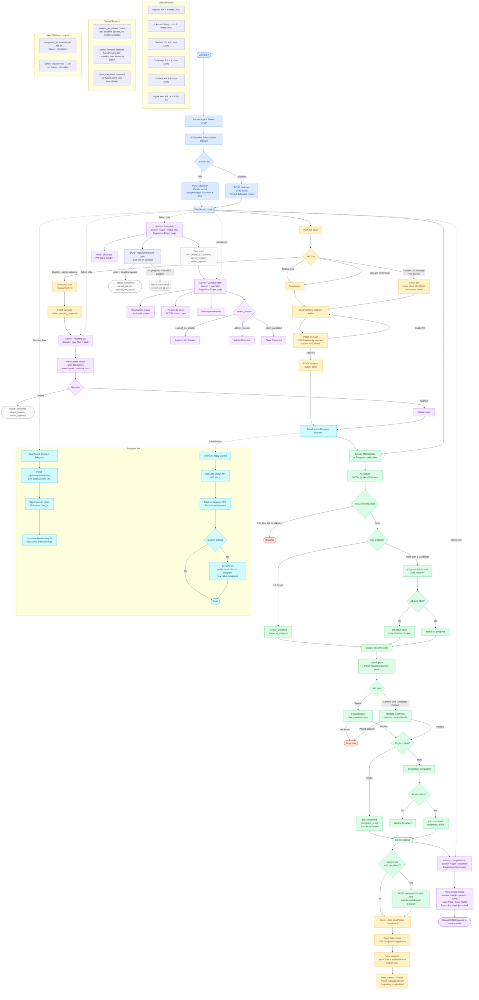

```mermaid
flowchart TD
    classDef auth fill:#dbeafe,stroke:#3b82f6,color:#1e40af
    classDef client fill:#fef3c7,stroke:#f59e0b,color:#92400e
    classDef creator fill:#dcfce7,stroke:#22c55e,color:#14532d
    classDef admin fill:#f3e8ff,stroke:#a855f7,color:#581c87
    classDef telegram fill:#cffafe,stroke:#06b6d4,color:#164e63
    classDef done fill:#f0fdf4,stroke:#16a34a,color:#14532d
    classDef err fill:#fee2e2,stroke:#ef4444,color:#7f1d1d
    classDef cancelled fill:#fafafa,stroke:#a3a3a3,color:#525252

    A1([Connect X]) --> A2[Reown AppKit Twitter OAuth]
    A2 --> A3[Embedded Solana wallet created]
    A3 --> A4{User in DB?}
    A4 -->|New| A5[POST /api/user\nCreate record\nScrapeBadger: followers + blue]
    A4 -->|Existing| A6[POST /api/user\nSync wallet\nRefresh followers + blue]
    A5 & A6 --> A7[[Dashboard ready]]

    A7 --> CL1[Post Job page]
    CL1 --> CL2{Job Type}
    CL2 -->|Repost 0.50| CL3[Fixed price]
    CL2 -->|Like and Reply 0.20| CL3
    CL2 -->|Content or Campaign\nTier pricing| CL4[Select tier\nNano Micro Mid Macro\nSet creator count]
    CL2 -->|Custom - admin approval| CL5[Free-form brief\nNo payment yet]

    CL3 & CL4 --> CL6[Send USDC to platform wallet]
    CL6 --> CL7[Paste TX hash\nPOST /api/verify-payment\nSolana RPC check]
    CL7 -->|Invalid TX| CL6
    CL7 -->|Valid TX| CL8[POST /api/jobs\nstatus: open]
    CL5 --> CL9[POST /api/jobs\nstatus: pending_approval]

    CL8 --> TGNOTIFY[Broadcast to Telegram channel]

    CL9 --> AD1[Admin - Pending tab\nSearch + type filter + table]
    AD1 --> AD1D[View Details modal\nbrief description\nreward proof creator access]
    AD1D --> AD2{Decision}
    AD2 -->|Reject| AD3([status: cancelled\ncancel_reason: admin_rejected])
    AD2 -->|Approve| AD4[status: open]
    AD4 --> TGNOTIFY

    TGNOTIFY --> CR1
    A7 --> CR1[Browse Marketplace\nor Telegram notification]
    CR1 --> CR2[Accept job\nPATCH /api/jobs/:id/accept]
    CR2 --> CR3{Requirements check}
    CR3 -->|Fail: blue tick or followers| CRERR([Rejected])
    CR3 -->|Pass| CR4{max creators?}

    CR4 -->|= 1 Single| CR5[creator_id locked\nstatus: in_progress]
    CR4 -->|more than 1 Campaign| CR6[job_completions row\nslots_taken++]
    CR6 --> CR7{All slots filled?}
    CR7 -->|No| CR8[Job stays open\nmore creators can join]
    CR7 -->|Yes| CR9[status: in_progress]

    CR5 & CR8 & CR9 --> CR10[Creator does the work]
    CR10 --> CR11[Submit proof\nPOST /api/jobs/:id/verify-proof]
    CR11 --> CR12{Job type}
    CR12 -->|Repost| CR13[ScrapeBadger\ncheck retweet exists]
    CR12 -->|Content Like Campaign Custom| CR14[Validate proof URL\nmatches creator handle]
    CR13 -->|Not found| PROOFERR([Retry later])
    CR14 -->|Wrong account| PROOFERR
    CR13 & CR14 -->|Verified| CR15{Single or Multi?}

    CR15 -->|Single| CR16[job: completed\ncompleted_at set\nStats incremented]
    CR15 -->|Multi| CR17[completion: completed]
    CR17 --> CR18{All slots done?}
    CR18 -->|No| CR19[Waiting for others]
    CR18 -->|Yes| CR20[job: completed\ncompleted_at set]

    CR16 & CR20 --> JOBDONE[[Job Completed]]

    JOBDONE --> EX1{Custom job\nwith extra fields?}
    EX1 -->|Yes| EX2[POST /api/jobs/:id/submit-info\nwallet email discord telegram]
    EX1 -->|No| CLREVIEW
    EX2 --> CLREVIEW

    CLREVIEW[Client - Jobs You Posted Dashboard]
    CLREVIEW --> RV1[Open Data modal\nGET /api/jobs/:id/applicants]
    RV1 --> RV2[View creators\nproof links + additional info\nExport CSV]
    RV2 --> RV3[Rate creator 1-5 stars\nPOST /api/jobs/:id/rate\nAvg rating recalculated]

    JOBDONE --> AD5[Admin - Completed tab\nSearch + type + paid filter\nPagination 20 per page]
    AD5 --> AD6[View Details modal\ncreator handle + proof + wallet\nMark Paid - Copy Wallet\nExport Excel per job or bulk]
    AD6 --> AD7([Manual USDC payout to creator wallet])

    AD_ACT[Admin - Active tab\nSearch + type + status filter\nPagination 20 per page]
    AD_ACT --> EXPIRE[POST /api/admin/expire-jobs\nauto-run on tab load]
    EXPIRE -->|open + deadline passed| AUTOCANCEL([status: cancelled\ncancel_reason: expired_no_creator])
    EXPIRE -->|in_progress + deadline passed| AUTOCOMPLETE([status: completed\ncompleted_at set])
    AD_ACT --> ADMHIDE[Hide / Show job\nPATCH is_hidden]
    AD_ACT --> ADMCANCEL[Cancel job\nPATCH status: cancelled\ncancel_reason: admin_rejected]
    ADMCANCEL --> AD_CAN

    AD_CAN[Admin - Cancelled tab\nSearch + type filter\nPagination 20 per page]
    AD_CAN --> CANREASON{cancel_reason}
    CANREASON -->|expired_no_creator| CANEXP[Expired - No Creator]
    CANREASON -->|admin_rejected| CANADM[Admin Rejected]
    CANREASON -->|client_cancelled| CANCLI[Client Cancelled]
    AD_CAN --> CANVIEW[View Details modal\nclient brief + meta]
    AD_CAN --> RESTORE[Restore to open\nPATCH status: open]
    AD_CAN --> CANDEL[Delete permanently]

    subgraph TG["Telegram Bot"]
        direction TB
        TG1[Dashboard: Connect Telegram] --> TG2[POST /api/telegram/connect\nLink token 15 min TTL]
        TG2 --> TG3[Open bot with token\nBot saves chat_id]
        TG3 --> TG4[Dashboard polls every 3s\nmax 2 min until confirmed]

        TG5[Channel: Apply via Bot] --> TG6[Bot calls accept API\nwith job id]
        TG6 --> TG7[User sends proof URL\nBot calls verify-proof]
        TG7 --> TG8{Custom extras?}
        TG8 -->|Yes| TG9[Bot collects\nwallet email discord telegram\nkey value messages]
        TG8 -->|No| TG10([Done])
        TG9 --> TG10
    end

    subgraph IDS["Job ID Format"]
        direction LR
        ID1["Repost: RH + 8 chars UUID"]
        ID2["Like and Reply: LH + 8 chars UUID"]
        ID3["Content: CH + 8 chars UUID"]
        ID4["Campaign: EH + 8 chars UUID"]
        ID5["Custom: XH + 8 chars UUID"]
        ID6["Agent jobs: RA LA CA EA XA"]
    end

    subgraph CANCEL_REASONS["Cancel Reasons"]
        direction LR
        CR_1["expired_no_creator: open job, deadline passed, no creator accepted"]
        CR_2["admin_rejected: rejected from Pending OR cancelled from Active by admin"]
        CR_3["client_cancelled: reserved for future client-side cancellation"]
    end

    subgraph DB_FIELDS["New DB Fields on jobs"]
        direction LR
        DB1["completed_at: timestamptz — set on status→completed"]
        DB2["cancel_reason: text — set on status→cancelled"]
    end

    A7 -.->|Connect flow| TG1
    TGNOTIFY -.->|Inline button| TG5
    A7 -.->|Admin only| AD1
    A7 -.->|Admin only| AD_ACT
    A7 -.->|Admin only| AD5
    A7 -.->|Admin only| AD_CAN

    class A1,A2,A3,A4,A5,A6,A7 auth
    class CL1,CL2,CL3,CL4,CL5,CL6,CL7,CL8,CL9,CLREVIEW,RV1,RV2,RV3 client
    class CR1,CR2,CR3,CR4,CR5,CR6,CR7,CR8,CR9,CR10,CR11,CR12,CR13,CR14,CR15,CR16,CR17,CR18,CR19,CR20,EX1,EX2 creator
    class AD1,AD1D,AD2,AD3,AD4,AD5,AD6,AD7,AD_ACT,ADMHIDE,ADMCANCEL,AD_CAN,CANVIEW,RESTORE,CANDEL,CANREASON,CANEXP,CANADM,CANCLI admin
    class TG1,TG2,TG3,TG4,TG5,TG6,TG7,TG8,TG9,TG10,TGNOTIFY telegram
    class JOBDONE done
    class CRERR,PROOFERR err
    class AUTOCANCEL,ADMCANCEL,AD3,AUTOCOMPLETE cancelled
```
